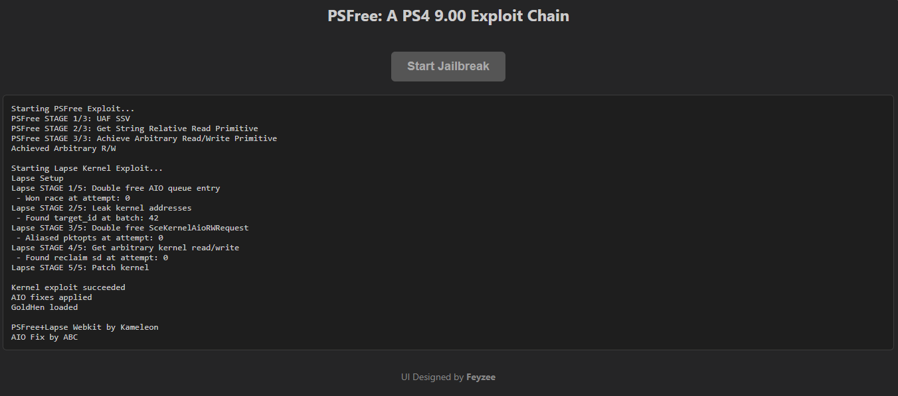

# PSFree WebKit Exploit & Lapse Kernel Exploit for PS4

This repository is a research fork of [PSFree](https://github.com/kmeps4/PSFree) that aims to improve the reliability and success rate of previously public exploit code. The project’s main motivation is twofold:

(1) increase stability and success rate through timing, error-handling and reliability improvements.

(2) reduce platform compatibility requirements by converting the existing mjs modular structure into plain js. The result is less modular structure but is more portable codebase intended for research and analysis.

By this changes the original modular .mjs structure has been refactored into a single-file .js implementation designed to execute in a more sequential, C-like flow. This approach improves readability, simplifies debugging and ensures consistent execution timing across environments.

  

---

## [1.0.0-research] - 2025-11-13

### Overview
Initial release of the **stability & success-rate improved** fork of PSFree.  
This version is based on the publicly available source code from  
[github.com/kmeps4/PSFree](https://github.com/kmeps4/PSFree)  
with extensive internal revisions to improve reliability during execution and reduce crash frequency.

### Major Changes
- Rewritten timing logic for better synchronization and thread consistency.  
- Added retry and recovery mechanisms to reduce race condition failures.  
- Enhanced error-handling routines to gracefully recover from invalid state transitions.  
- Memory alignment adjustments to improve consistency across different browsers or environments.  
- Improved logging and diagnostic output for easier debugging and reproducibility.  
- Simplified some initialization sequences to reduce race sensitivity.  
- Minor refactoring of code layout for readability and maintainability.  
- Updated build scripts and removed obsolete debug leftovers.  

### Removed / Excluded
- All payload binaries (`*.bin`, `*.elf`) were intentionally excluded.  
- Step-by-step jailbreak instructions were omitted for legal and ethical compliance.  
- No modifications that alter the exploit logic in ways affecting device security outside test context.

### Legal & Safety Notice
- Distributed for **research and educational purposes only**.  
- The maintainers do not endorse or promote illegal use.  
- Use at your own risk — no liability for damage, data loss, or misuse.

---

## [Unreleased]

Planned improvements for future versions may include:
- Further timing calibration and error-state analytics.  
- Optional diagnostic module for internal stability testing (non-operational).  
- Code comments and documentation expansion.  

---

**License:**  
This project continues under the same open-source license as the original PSFree repository (**AGPL-3.0-or-later**).  
Please review the license before redistributing or modifying the code.

---
